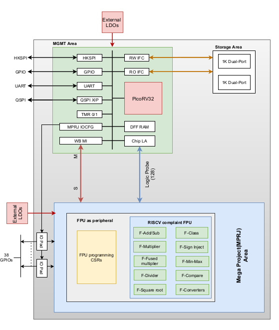

<!---
# SPDX-FileCopyrightText: 2020 Efabless Corporation
#
# Licensed under the Apache License, Version 2.0 (the "License");
# you may not use this file except in compliance with the License.
# You may obtain a copy of the License at
#
#      http://www.apache.org/licenses/LICENSE-2.0
#
# Unless required by applicable law or agreed to in writing, software
# distributed under the License is distributed on an "AS IS" BASIS,
# WITHOUT WARRANTIES OR CONDITIONS OF ANY KIND, either express or implied.
# See the License for the specific language governing permissions and
# limitations under the License.
#
# SPDX-License-Identifier: Apache-2.0
-->

# Table of contents
- [Caravel FPU](#caravel-fpu)
	- [Floating Point Unit](#floating-point-unit)
		- [FPU Architecture](#fpu-architecture)
		- [FPU Exceptions](#fpu-exceptions)
	- [Integration of FPU as Memory Mapped Peripheral](#integration-of-fpu-as-memory-mapped-peripheral)
		- [Wishbone Interface](#wishbone-interface)
		- [Logic Analyzer](#logic-analyzer)
		- [GPIO](#gpio)
	- [CSRs for FPU](#csrs-for-fpu)
	- [Instruction Flow](#instruction-flow)

# Caravel FPU

  

## Floating Point Unit

 A floating-point unit (FPU), also referred to as numeric co-processor, is a dedicated processing unit that manipulates numbers more quickly than the basic microprocessor circuit. The FPU does this by means of instructions that focus entirely on large mathematical operations such as addition, subtraction, multiplication, or division etc. The F-extension added in user project area, also referred to as FPU is capable to perform floating point addition, subtraction, multiplication, division, square-root and fused multiplication.The block diagram is shown in figure 1.1. 

 
 

<b>Figure 1.1: Integration of FPU with Caravel SoC</b>

	
### FPU Architecture

 The designed floating-point unit (FPU) is fully compliant with the IEEE-754 standard. It flags all five exceptions explained in subsection xx during result calculation as guided by IEEE-754 spec and has support to round result as per the five rounding modes. Additionally support for dynamic rounding is also added as indicated in RISC-V specifications. The rounding modes are explained in table 1.1. For being compliant with RISC-V F-Extension the unit is capable of performing basic arithmetic operations like comparison, addition, subtraction and multiplication. Moreover, the support for certain complex operations like division, square root of a number and computation of fused multiply-add. Certain other computational operations like integer to float conversion, float to integer conversion, computation of minimum and maximum of the two numbers along with sign injection is added. Caravel SoC core acts as a Wishbone master providing IP with control signals like data, address, cycle and strobe. The signals write FPU CSRs (explained in section 1.2.1) are decoded to provide information including operand A, operand B and operand C. Additionally, the operation that is to be performed and the rounding mode to be used are also provided. The selected module performs operation and the output result is written to an FPU CSR along with the exceptions flagged. The result and exceptions are then forwarded by wb_s to the core when requested.

 
 

	
<b>Figure 1.2: Interface of FPU with wishbone interface</b>

<figure class="table op-uc-figure_align-center op-uc-figure"><table class="op-uc-table"><tbody><tr class="op-uc-table--row"><td class="op-uc-table--cell"><strong>Rounding Mode</strong></td><td class="op-uc-table--cell"><strong>Abbreviation</strong></td><td class="op-uc-table--cell"><strong>Encoding</strong></td></tr><tr class="op-uc-table--row"><td class="op-uc-table--cell">Round to Nearest, ties to Even</td><td class="op-uc-table--cell">RNE</td><td class="op-uc-table--cell">000</td></tr><tr class="op-uc-table--row"><td class="op-uc-table--cell">Round towards Zero</td><td class="op-uc-table--cell">RTZ</td><td class="op-uc-table--cell">001</td></tr><tr class="op-uc-table--row"><td class="op-uc-table--cell">Round Down (towards - inf)</td><td class="op-uc-table--cell">RDM</td><td class="op-uc-table--cell">010</td></tr><tr class="op-uc-table--row"><td class="op-uc-table--cell">Round Up (towards + inf)</td><td class="op-uc-table--cell">RUP</td><td class="op-uc-table--cell">011</td></tr><tr class="op-uc-table--row"><td class="op-uc-table--cell">Round to Nearest, ties to Max Magnitude</td><td class="op-uc-table--cell">RMM</td><td class="op-uc-table--cell">100</td></tr></tbody></table></figure>

The default rounding mode for all the operations is RNE as highlighted by RISC-V and IEEE-754 spec.

### FPU Exceptions

 FPU can flag five exceptions depending upon the result during computation.
1. Invalid operation (NV) The exception is raised if the operation performed is mathematically incorrect.
2. Divide by zero (DZ) This exception is flagged only by division module and as the name suggests it is raised when the divider is zero.
3. Overflow (OF) If the computed result exceeds the maximum re-presentable range of single precision the exception is raised.
4. Underflow (UF) If the result is smaller than the minimum representation of the single precision then UF exception is set high.
5. Inexact (NX) Whenever the data cannot be expressed accurately after rounding, the exception is raised.

## Integration of FPU as Memory Mapped Peripheral
### Wishbone Interface

 A memory mapped peripheral is a hardware device with a specific address range in memory that the core writes data to and reads data from. FPU is integrated with the core using Wishbone interface. The core acts as a master while IP acts as a wb_s. A valid signal is sent from the interface to IP following which the IP starts operation depending on the instruction from core. Once the IP has performed the operation, it sets acknowledge ack indicating that operation is completed. The unit is controlled via set of control and status registers (CSRs) that are explained later in this document.

### Logic Analyzer

 Logic analyzer is used to operate the FPU externally for debugging pupose. FPU CSRs can be read/written by giving CSR address and data at logic analyzer input probes. Moreover, FPU unit can be operated through external clock and reset using logic analyzer input probes. Output data appears at the lower 32 bits of logic analyzer output probes.

### GPIO 
Result of FPU calculation also appers at the 32 GPIO pins.

## CSRs for FPU

 An overview of the CSRs implemented and their memory mapping is presented in the table

<figure class="table op-uc-figure_align-center op-uc-figure"><table class="op-uc-table"><tbody><tr class="op-uc-table--row"><td class="op-uc-table--cell"><strong>CSR</strong></td><td class="op-uc-table--cell"><strong>Access Type</strong></td><td class="op-uc-table--cell"><strong>Offset</strong></td></tr><tr class="op-uc-table--row"><td class="op-uc-table--cell">Operand A</td><td class="op-uc-table--cell">Read/Write</td><td class="op-uc-table--cell">0x00</td></tr><tr class="op-uc-table--row"><td class="op-uc-table--cell">Operand B</td><td class="op-uc-table--cell">Read/Write</td><td class="op-uc-table--cell">0x04</td></tr><tr class="op-uc-table--row"><td class="op-uc-table--cell">Operand C</td><td class="op-uc-table--cell">Read/Write</td><td class="op-uc-table--cell">0x08</td></tr><tr class="op-uc-table--row"><td class="op-uc-table--cell">Result</td><td class="op-uc-table--cell">Read</td><td class="op-uc-table--cell">0x0C</td></tr><tr class="op-uc-table--row"><td class="op-uc-table--cell">Operation Completed</td><td class="op-uc-table--cell">Read</td><td class="op-uc-table--cell">0x10</td></tr><tr class="op-uc-table--row"><td class="op-uc-table--cell">Operation Done</td><td class="op-uc-table--cell">Read/Clear</td><td class="op-uc-table--cell">0x14</td></tr><tr class="op-uc-table--row"><td class="op-uc-table--cell">Operation</td><td class="op-uc-table--cell">Read/Write</td><td class="op-uc-table--cell">0x1C</td></tr><tr class="op-uc-table--row"><td class="op-uc-table--cell">FFLAGS</td><td class="op-uc-table--cell">Read/Write</td><td class="op-uc-table--cell">0x20</td></tr><tr class="op-uc-table--row"><td class="op-uc-table--cell">FRM</td><td class="op-uc-table--cell">Read/Write</td><td class="op-uc-table--cell">0x24</td></tr><tr class="op-uc-table--row"><td class="op-uc-table--cell">FCSR</td><td class="op-uc-table--cell">Read/Write</td><td class="op-uc-table--cell">0x28</td></tr></tbody></table></figure>

 All the CSRs are located in the user design space with the base address of 0x3000_0000 + the offset described in table 1.2. The description of CSRs can be seen in following table

<figure class="table op-uc-figure_align-center op-uc-figure"><table class="op-uc-table"><tbody><tr class="op-uc-table--row"><td class="op-uc-table--cell"><strong>Field</strong></td><td class="op-uc-table--cell"><strong>Width</strong></td><td class="op-uc-table--cell"><strong>Description</strong></td></tr><tr class="op-uc-table--row"><td class="op-uc-table--cell">Operand A</td><td class="op-uc-table--cell">32-bit</td><td class="op-uc-table--cell">Input operand A</td></tr><tr class="op-uc-table--row"><td class="op-uc-table--cell">Operand B</td><td class="op-uc-table--cell">32-bit</td><td class="op-uc-table--cell">Input operand B</td></tr><tr class="op-uc-table--row"><td class="op-uc-table--cell">Operand C</td><td class="op-uc-table--cell">32-bit</td><td class="op-uc-table--cell">Input operand C</td></tr><tr class="op-uc-table--row"><td class="op-uc-table--cell">Result</td><td class="op-uc-table--cell">32-bit</td><td class="op-uc-table--cell">Result of the operation</td></tr></tbody></table></figure>

 The CSR operation completed holds a 2-bit value at bits 1 down to 0 that specifies the float to int, int to float, add/subtract, MAC, min-max, compare and sign injection operation. This CSR also holds an 11-bit value that shows which arithmetic operation has been completed. The encoding of the fields can be seen in the following table

<figure class="table op-uc-figure_align-center op-uc-figure"><table class="op-uc-table"><tbody><tr class="op-uc-table--row"><td class="op-uc-table--cell"><strong>Field</strong></td><td class="op-uc-table--cell"><strong>Width</strong></td><td class="op-uc-table--cell"><strong>Description</strong></td></tr><tr class="op-uc-table--row"><td class="op-uc-table--cell" style="vertical-align:top;">OP</td><td class="op-uc-table--cell" style="vertical-align:top;">2-bit</td><td class="op-uc-table--cell">float to int: &nbsp; &nbsp; 00 -&gt; unsigned &nbsp; &nbsp; 01 -&gt; signed int to float: &nbsp; &nbsp; 00 -&gt; unsigned &nbsp; &nbsp; 01 -&gt; signed add/subtract: &nbsp; &nbsp; 00 -&gt; add &nbsp; &nbsp; 01 -&gt; subtract mac: &nbsp; &nbsp; 00 -&gt; FMADD &nbsp; &nbsp; 01 -&gt; FMSUB &nbsp; &nbsp; 10 -&gt; FNMADD &nbsp; &nbsp; 11 -&gt; FNMSUB min-max &nbsp; &nbsp; 00 -&gt; min &nbsp; &nbsp; 01 -&gt; max compare &nbsp; &nbsp; 00 -&gt; LTE &nbsp; &nbsp; 01 -&gt; LT &nbsp; &nbsp; 10 -&gt; EQ sign injection &nbsp; &nbsp; 00 -&gt; FSGNJ &nbsp; &nbsp; 01 -&gt; FSGNJN &nbsp; &nbsp; 10 -&gt; FSGNJX</td></tr><tr class="op-uc-table--row"><td class="op-uc-table--cell" style="vertical-align:top;">Operation In-flight</td><td class="op-uc-table--cell" style="vertical-align:top;">11-bit</td><td class="op-uc-table--cell">02 -&gt; f-class 03 -&gt; sign inject 04 -&gt; compare 05 -&gt; min-max 06 -&gt; int to float 07 -&gt; float to int 08 -&gt; add/sub 09 -&gt; multiply 10 -&gt; mac 11 -&gt; divide 12 -&gt; square root</td></tr></tbody></table></figure>

 The CSR operation also holds the same encoding as CSR operation completed in ablove table which controls the operation to be performed.
The CSR operation done holds a single bit that gets set high when an operation completes. This can be seen in table below

<figure class="table op-uc-figure_align-center op-uc-figure"><table class="op-uc-table"><tbody><tr class="op-uc-table--row"><td class="op-uc-table--cell"><strong>Field</strong></td><td class="op-uc-table--cell"><strong>Width</strong></td><td class="op-uc-table--cell"><strong>Description</strong></td></tr><tr class="op-uc-table--row"><td class="op-uc-table--cell">Operation Done</td><td class="op-uc-table--cell">1-bit</td><td class="op-uc-table--cell">Signifies completion of operation</td></tr></tbody></table></figure>

 FFLAGS and FRM are both fields of FCSR that can be individually accessed with dedicated addresses. FFLAGS hold a 5-bit value that corresponds to the exceptions raised by the operation performed. FRM holds a 3-bit value to representing the rounding mode to be used. The encoding for these fields can be seen in table

<figure class="table op-uc-figure_align-center op-uc-figure"><table class="op-uc-table"><tbody><tr class="op-uc-table--row"><td class="op-uc-table--cell"><strong>Field</strong></td><td class="op-uc-table--cell"><strong>Width</strong></td><td class="op-uc-table--cell"><strong>Description</strong></td></tr><tr class="op-uc-table--row"><td class="op-uc-table--cell">FFLAGS</td><td class="op-uc-table--cell">5-bit</td><td class="op-uc-table--cell">0 -&gt; inexact 1 -&gt; underflow 2 -&gt; overflow 3 -&gt; divide by zero 4 -&gt; invalid operation</td></tr><tr class="op-uc-table--row"><td class="op-uc-table--cell">FRM</td><td class="op-uc-table--cell">3-bit</td><td class="op-uc-table--cell">encoding in table xx</td></tr></tbody></table></figure>

## Instruction Flow

 The instruction to any memory mapped peripheral is merely a load or store instruction. To perform any operation the following steps are required:
1. Write each operand with a store instruction to the core.
2. Write FRM to set the rounding mode to be used with a store instruction.
3. Operation to be performed is also specified by a store instruction.
4. Once the operation is completed it can be accessed by the core from result CSR with a load instruction

